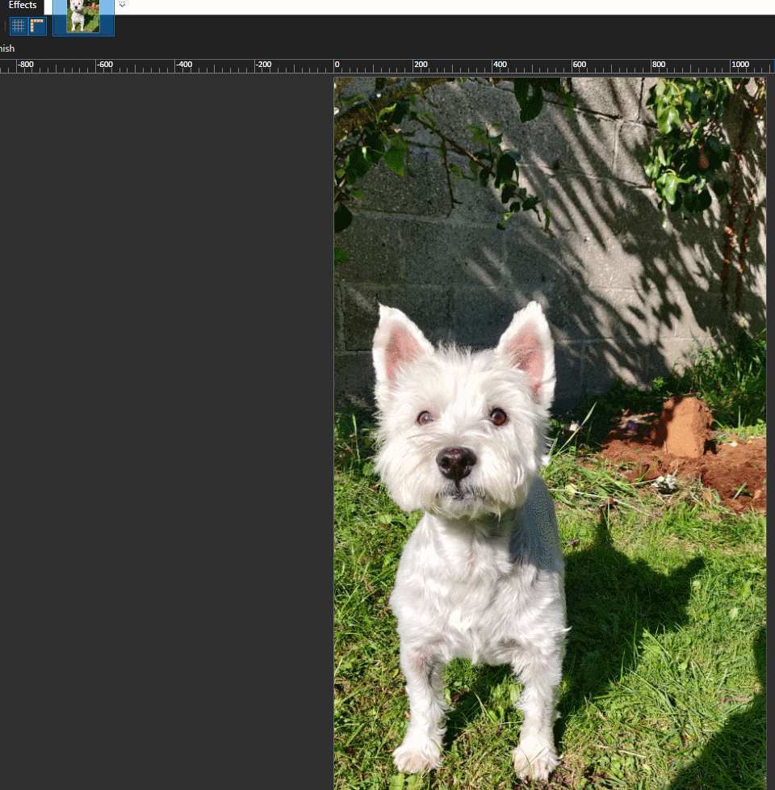

# Remove.BG Effect for Paint.NET

## About
This is an Effect for Paint.NET that allows you to directly interface with [RemoveBG](https://www.remove.bg/) to automatically remove background content from your images

The plugin appears under the tools pane in Paint.NET

## Example

## API Key
You will be prompted for your RemoveBG API Key on first executing the Effect. This will be stored in config.json next to the DLL in the Effect directory.

You can get your own API key [here](https://www.remove.bg/dashboard#api-key)

Credits will be consumed from your Subscription Credits or Pay As You Go credits first, and then fall back to using Free Preview Credits afterwards. Free Preview Credits have a lower resolution, so the plugin will resize the response to match the original resolution which may result in a drop in quality.

## Installation

See [Installing Additional Plugins](https://www.getpaint.net/doc/latest/InstallPlugins.html) for instructions.